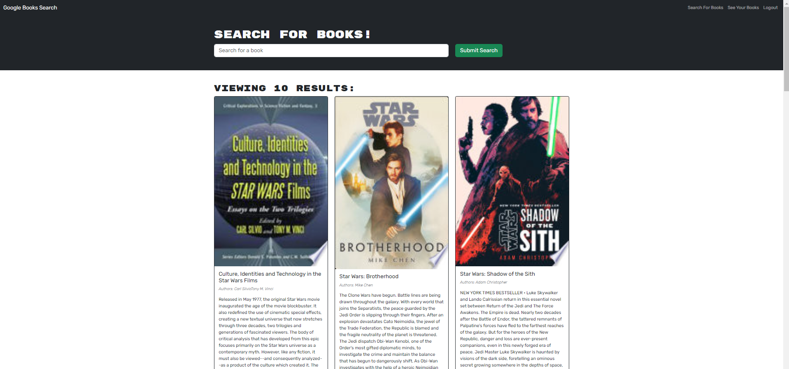

# MERN Book Search

https://mern-book-search-engine-h5yy.onrender.com/

## Description

In this program I built on top of starter code with a fully functioning Google Books API search engine built with a RESTful API, and refactored it to be a GraphQL API built with Apollo Server. The app was built using the MERN stack with a React front end, MongoDB database, and Node.js/Express.js server and API. Once a user has created an account or logged in they can search for books using the Google Books API. They can then save books to their own favourites page and delete books from their favourites. I did this to gain a deeper understanding of GraphQL and Apollo.

- [Installation](#installation)

- [Usage](#usage)

- [Badges](#badges)

- [Contribute](#contribute)

## Installation

No installation needed. This web app is hosted on Render.

## Usage

The user must first create an account by providing a username, email and password. This will log the user in automatically. Alternatively an existing user can log in using their email and password. Users can use the search bar to find books and click the 'Save This Book' button to save to their favourites. Click on the 'See Your Books' link at the top of the page to view your see saved books.

- [License](#license)

## Badges

## License

This software is licensed under the MIT license.

## Contribute

Please feel free to reach out if you would like to discuss collaboration.
